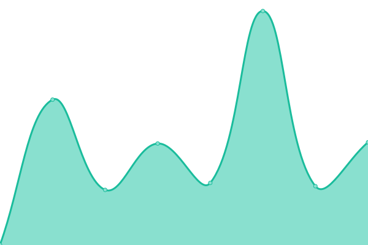
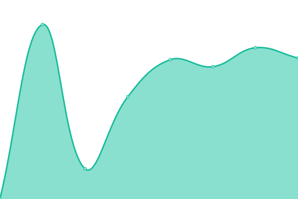

# [📈 Live Status](https://ripplelog.xyz): <!--live status--> **🟧 部分停机**

This repository contains the open-source uptime monitor and status page for [celestialripple](https://ripplelog.xyz), powered by [Upptime](https://github.com/upptime/upptime).

With [Upptime](https://upptime.js.org), you can get your own unlimited and free uptime monitor and status page, powered entirely by a GitHub repository. We use [Issues](https://github.com/celestialripple/ripplelog/issues) as incident reports, [Actions](https://github.com/celestialripple/ripplelog/actions) as uptime monitors, and [Pages](https://ripplelog.xyz) for the status page.

<!--start: status pages-->
<!-- This summary is generated by Upptime (https://github.com/upptime/upptime) -->
<!-- Do not edit this manually, your changes will be overwritten -->
<!-- prettier-ignore -->
| 链接 | 状态 | 历史 | 响应时间 | 正常运行时间 |
| --- | ------ | ------- | ------------- | ------ |
|  [hiRipple](hiripple.com) | 🟩 正常运行 | [hi-ripple.yml](https://github.com/CelestialRipple/ripplelog/commits/HEAD/history/hi-ripple.yml) | 

 952毫秒
     
 | 

<a href="https://status.hiripple.com/history/hi-ripple">100.00%</a>
    

|  [qinglong](ql.hiripple.com) | 🟩 正常运行 | [qinglong.yml](https://github.com/CelestialRipple/ripplelog/commits/HEAD/history/qinglong.yml) | 

 2227毫秒
     
 | 

<a href="https://status.hiripple.com/history/qinglong">81.38%</a>
    

|  [nginx proxy](ngnew.hiripple.com) | 🟩 正常运行 | [nginx-proxy.yml](https://github.com/CelestialRipple/ripplelog/commits/HEAD/history/nginx-proxy.yml) | 

 436毫秒
     
 | 

<a href="https://status.hiripple.com/history/nginx-proxy">100.00%</a>
    

|  [克劳德™](cloud.hiripple.com) | 🟩 正常运行 | [.yml](https://github.com/CelestialRipple/ripplelog/commits/HEAD/history/.yml) | 

 571毫秒
     
 | 

<a href="https://status.hiripple.com/history/">51.68%</a>
    

|  [docker](https://docker.hiripple.com) | 🟥 停机 | [docker.yml](https://github.com/CelestialRipple/ripplelog/commits/HEAD/history/docker.yml) | 

 615毫秒
     
 | 

<a href="https://status.hiripple.com/history/docker">0.00%</a>
    

|  [Vaultwarden](https://pass.hiripple.com) | 🟩 正常运行 | [vaultwarden.yml](https://github.com/CelestialRipple/ripplelog/commits/HEAD/history/vaultwarden.yml) | 

 643毫秒
     
 | 

<a href="https://status.hiripple.com/history/vaultwarden">100.00%</a>
    

|  [Nextcloud](https://nextcloud.hiripple.com) | 🟥 停机 | [nextcloud.yml](https://github.com/CelestialRipple/ripplelog/commits/HEAD/history/nextcloud.yml) | 

 3745毫秒
     
 | 

<a href="https://status.hiripple.com/history/nextcloud">80.43%</a>
    

|  [Alist](https://alist.hiripple.com) | 🟥 停机 | [alist.yml](https://github.com/CelestialRipple/ripplelog/commits/HEAD/history/alist.yml) | 

 2651毫秒
     
 | 

<a href="https://status.hiripple.com/history/alist">79.86%</a>
    

|  [HomeAssistant](https://ha.hiripple.com) | 🟩 正常运行 | [home-assistant.yml](https://github.com/CelestialRipple/ripplelog/commits/HEAD/history/home-assistant.yml) | 

 2097毫秒
     
 | 

<a href="https://status.hiripple.com/history/home-assistant">79.57%</a>
    

|  [jackett](https://torrent.hiripple.com) | 🟥 停机 | [jackett.yml](https://github.com/CelestialRipple/ripplelog/commits/HEAD/history/jackett.yml) | 

 0毫秒
     
 | 

<a href="https://status.hiripple.com/history/jackett">0.00%</a>
    

|  [MyNas](https://unraid.hiripple.com) | 🟥 停机 | [my-nas.yml](https://github.com/CelestialRipple/ripplelog/commits/HEAD/history/my-nas.yml) | 

 3187毫秒
     
 | 

<a href="https://status.hiripple.com/history/my-nas">79.36%</a>
    

<!--end: status pages-->

[**Visit our status website →**](https://ripplelog.xyz)

## 📄 License

- Powered by: [Upptime](https://github.com/upptime/upptime)
- Code: [MIT](./LICENSE) © [celestialripple](https://ripplelog.xyz)
- Data in the `./history` directory: [Open Database License](https://opendatacommons.org/licenses/odbl/1-0/)
