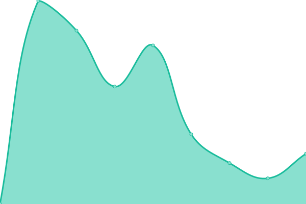

# [📈 Live Status](https://ripplelog.xyz): <!--live status--> **🟧 部分停机**

This repository contains the open-source uptime monitor and status page for [celestialripple](https://ripplelog.xyz), powered by [Upptime](https://github.com/upptime/upptime).

With [Upptime](https://upptime.js.org), you can get your own unlimited and free uptime monitor and status page, powered entirely by a GitHub repository. We use [Issues](https://github.com/celestialripple/ripplelog/issues) as incident reports, [Actions](https://github.com/celestialripple/ripplelog/actions) as uptime monitors, and [Pages](https://ripplelog.xyz) for the status page.

<!--start: status pages-->
<!-- This summary is generated by Upptime (https://github.com/upptime/upptime) -->
<!-- Do not edit this manually, your changes will be overwritten -->
<!-- prettier-ignore -->
| 链接 | 状态 | 历史 | 响应时间 | 正常运行时间 |
| --- | ------ | ------- | ------------- | ------ |
|  [hiRipple](hiripple.com) | 🟩 正常运行 | [hi-ripple.yml](https://github.com/CelestialRipple/ripplelog/commits/HEAD/history/hi-ripple.yml) | 

 787毫秒
     
 | 

<a href="https://status.hiripple.com/history/hi-ripple">100.00%</a>
    

|  [qinglong](qinglong.hiripple.com) | 🟩 正常运行 | [qinglong.yml](https://github.com/CelestialRipple/ripplelog/commits/HEAD/history/qinglong.yml) | 

 896毫秒
     
 | 

<a href="https://status.hiripple.com/history/qinglong">100.00%</a>
    

|  [Xray proxy](xray.hiripple.com) | 🟩 正常运行 | [xray-proxy.yml](https://github.com/CelestialRipple/ripplelog/commits/HEAD/history/xray-proxy.yml) | 

 897毫秒
     
 | 

<a href="https://status.hiripple.com/history/xray-proxy">100.00%</a>
    

|  [nginx proxy](ng2.hiripple.com) | 🟩 正常运行 | [nginx-proxy.yml](https://github.com/CelestialRipple/ripplelog/commits/HEAD/history/nginx-proxy.yml) | 

 752毫秒
     
 | 

<a href="https://status.hiripple.com/history/nginx-proxy">100.00%</a>
    

|  [克劳德™](cloud.hiripple.com) | 🟩 正常运行 | [.yml](https://github.com/CelestialRipple/ripplelog/commits/HEAD/history/.yml) | 

 824毫秒
     
 | 

<a href="https://status.hiripple.com/history/">35.25%</a>
    

|  [Draw](https://draw.hiripple.com) | 🟩 正常运行 | [draw.yml](https://github.com/CelestialRipple/ripplelog/commits/HEAD/history/draw.yml) | 

 625毫秒
     
 | 

<a href="https://status.hiripple.com/history/draw">99.56%</a>
    

|  [docker](https://docker.hiripple.com) | 🟩 正常运行 | [docker.yml](https://github.com/CelestialRipple/ripplelog/commits/HEAD/history/docker.yml) | 

 910毫秒
     
 | 

<a href="https://status.hiripple.com/history/docker">100.00%</a>
    

|  [video](https://video.hiripple.com) | 🟩 正常运行 | [video.yml](https://github.com/CelestialRipple/ripplelog/commits/HEAD/history/video.yml) | 

 786毫秒
     
 | 

<a href="https://status.hiripple.com/history/video">100.00%</a>
    

|  [music](https://music.hiripple.com) | 🟩 正常运行 | [music.yml](https://github.com/CelestialRipple/ripplelog/commits/HEAD/history/music.yml) | 

 710毫秒
     
 | 

<a href="https://status.hiripple.com/history/music">85.60%</a>
    

|  [Vaultwarden](https://pass.hiripple.com) | 🟩 正常运行 | [vaultwarden.yml](https://github.com/CelestialRipple/ripplelog/commits/HEAD/history/vaultwarden.yml) | 

 558毫秒
     
 | 

<a href="https://status.hiripple.com/history/vaultwarden">99.56%</a>
    

|  [mirror](https://mirror.hiripple.com) | 🟥 停机 | [mirror.yml](https://github.com/CelestialRipple/ripplelog/commits/HEAD/history/mirror.yml) | 

 1369毫秒
     
 | 

<a href="https://status.hiripple.com/history/mirror">35.74%</a>
    

<!--end: status pages-->

[**Visit our status website →**](https://ripplelog.xyz)

## 📄 License

- Powered by: [Upptime](https://github.com/upptime/upptime)
- Code: [MIT](./LICENSE) © [celestialripple](https://ripplelog.xyz)
- Data in the `./history` directory: [Open Database License](https://opendatacommons.org/licenses/odbl/1-0/)
